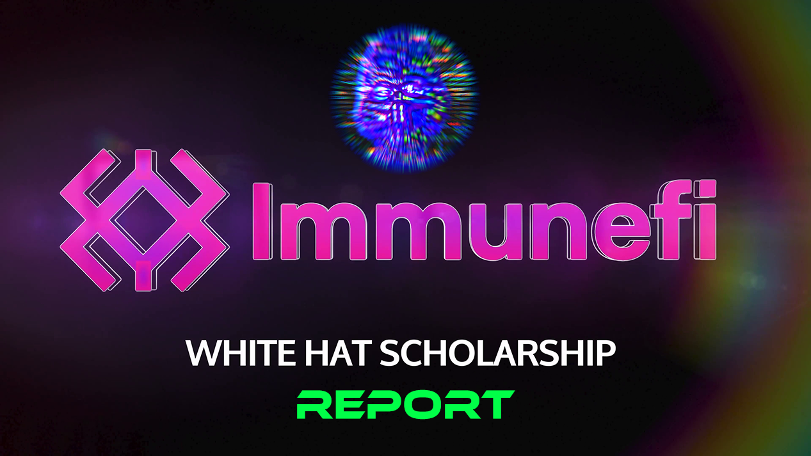
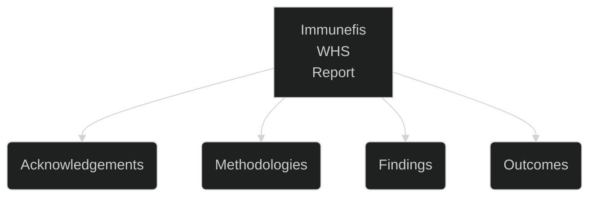
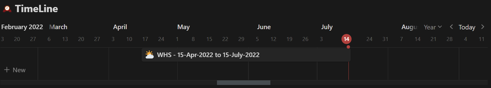

# 🟢 ACKNOWLEDGEMENTS

# 🎓 Immunefi White Hat Scholarship [WHS] 

## Time Period 

# 🤝 Involved Parties

I would like to take this opportunity to thank the following individuals who had given me the tremendous pleasure and honor to have been given the chance to explore and hack in the `web3` space

N | Person | Function
|:--|:--:|:--:|
1 | [Immunefi Discord Community](https://discord.gg/rpkPDR7pVV?utm_source=immunefi) | For the fun, frolic, laughter and an amazing learning experience. 
2 | [@MitchellAmador](https://twitter.com/MitchellAmador) & [@duncancmt](https://twitter.com/duncancmt) | For building [Immunefi](https://immunefi.com/) which is the permier, most sought after `web3` Bug Bounty Platform 
3 | [@Ivanbenavides_](https://twitter.com/Ivanbenavides_) | Who was the main assessor of my application and who gav me this amazing opportunity 
4 | [@Pep1nn](https://twitter.com/Pep1nn) | Who patiently listens and my constant queries
5 | [jonahm#1396](discordapp.com/users/786775850019323915) | For enabling the necessary logistics to ensure I was all sorted.
6 | Frens | To have made this learning and `hacking` experience memorable.
