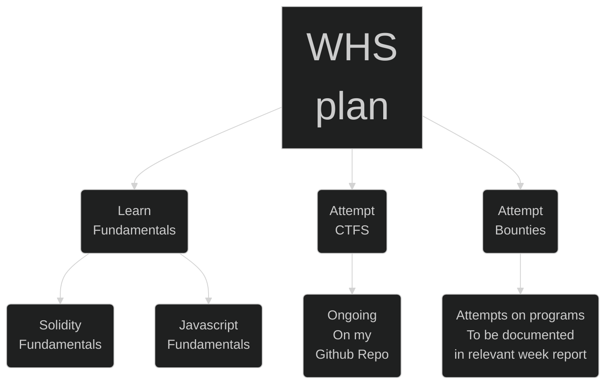
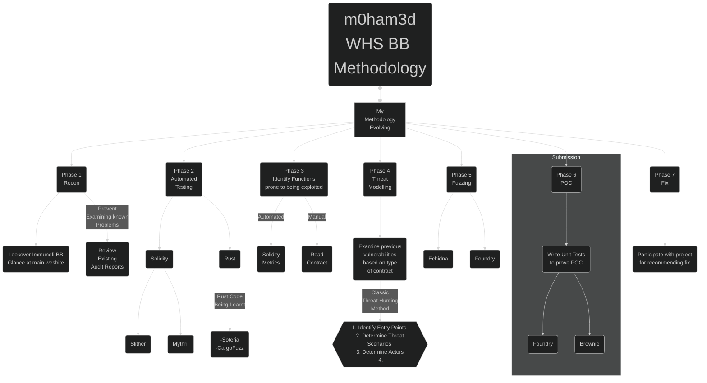

# 🟠 METHODOLOGIES 

This section will be regarding my general approach and related matters. 

> 👉 I have made some mention of the various tooling which are in use. These however can be considered adequate, they are purely my personal choices

# 🧡 Game Plan 

When I came into the `web3` security space, I was already researching this area with the plan of doing a startup. So I was constantly familiarizing myself with *blockchain* technologies and focussing on the devleopment aspect. Prior to that I was what you call a "security enthusiast" in the web2 (traditional centralized computing) domain. 

The `web3` space during that period was under constant exploitation, with astronomical sums being [lost.](https://web3isgoinggreat.com/) This was the impetus that led me down this rabbit hole

The above map was my own take on this matter after researching several learning paths. The good news was that the area of `web3 Security` was already heavily under investigation. This led to a wide variety of information which was available online. My primary research reference was [w3bs3c - Compilation of Web3 Security](https://www.w3bs3c.com/). 

# 🧡 Constantly Evolving Methodology 

The following methodology was arrived at after researching existing `web2` & `web3` methodologies. They are derived from documentation detailed practical debugging or code.  

The summary of the above diagram is as follows 

1. **Phase 1** - Recon - Which means gathering information about your target, this phase is considered to be the most important phase in this process, poor recon leads to inability of identify bugs. 

2. **Phase 2** - Automated Testing - This is often used for baselining. Usually most projects already use automated testing in their testine pipelines. However as the code base gets constantly updated, the <u>probability</u> of logical errors go up, and <i>automated tooling</i> is a fast way (albeit not the most precise way, due to the presence of false positives).
 