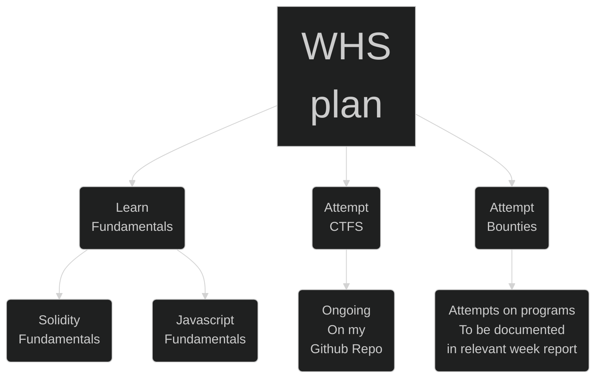
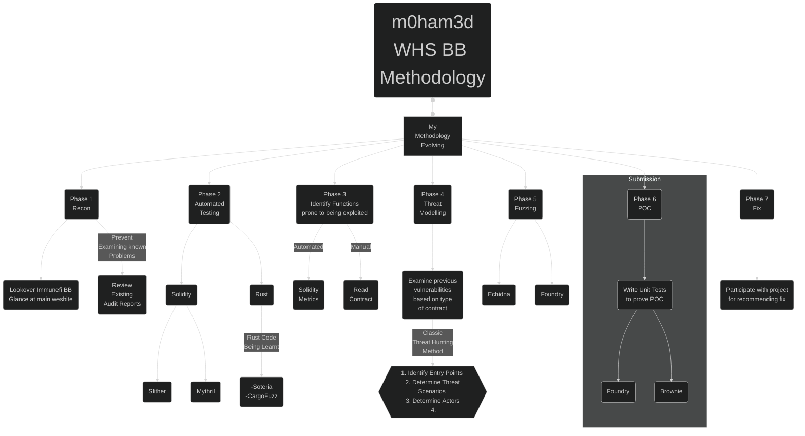
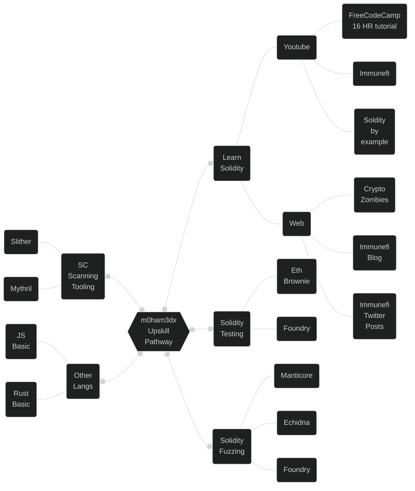

# 🟠 METHODOLOGIES 

This section will be regarding my general approach and related matters. 

> 👉 I have made some mention of the various tooling which are in use. These however can be considered adequate, they are purely my personal choices

# 🧡 Game Plan 

When I came into the `web3` security space, I was already researching this area with the plan of doing a startup. So I was constantly familiarizing myself with *blockchain* technologies and focussing on the devleopment aspect. Prior to that I was what you call a "security enthusiast" in the web2 (traditional centralized computing) domain. 

The `web3` space during that period was under constant exploitation, with astronomical sums being [lost.](https://web3isgoinggreat.com/) This was the impetus that led me down this rabbit hole

The above map was my own take on this matter after researching several learning paths. The good news was that the area of `web3 Security` was already heavily under investigation. This led to a wide variety of information which was available online. My primary research reference was [w3bs3c - Compilation of Web3 Security](https://www.w3bs3c.com/). 

# 🧡 Constantly Evolving Methodology 

The following methodology was arrived at after researching existing `web2` & `web3` methodologies. They are derived from documentation detailed practical debugging or code.  

The summary of the above diagram is as follows 

1. **Phase 1 - Recon** - Which means gathering information about your target, this phase is considered to be the most important phase in this process, poor recon leads to inability of identify bugs. 

2. **Phase 2 - Automated Testing** - This is often used for baselining. Usually most projects already use automated testing in their testine pipelines. However as the code base gets constantly updated, the <u>probability</u> of logical errors go up, and <i>automated tooling</i> is a fast way (albeit not the most precise way, due to the presence of false positives).
 
 3. **Phase 3 - Exploitable Functions** - This step involves functions that are prone to being exploited , some eg: of arbitray functions - 
    1. `depositFunds()` - For depoisiting crypto in
    2. `withdrawFunds()` - For withdrawing crypto
   

> 👉 [Smart Contract Weakness Classification Registry (SCWCR)](https://github.com/SmartContractSecurity/SWC-registry) - A repository of known vulnerability issues in Ethereum

4. **Phase 4 - Threat Modelling** - Once vulnerable code has been identified, the next step to assess the risk of those functions in simulated conditions. As a good starting point, it was recommended to read about past attacks, that given technical details on how the exploit occurred.

> 👉 [The three core levels of thinking for a Bug Hunter](https://twitter.com/joranhonig/status/1546837558730047488?s=20&t=hBTDVECNHoB0a0WLTXRrJQ) - Excellent tweet threat on threat modelling methodology in general.

5. **Phase 5 - Fuzzing** - Accomplished by tooling that can rapidly input a wide range of inputs to assess the behavior of a function. *Note - This step is not necessarily agreed upon, but in my opinion is a fast way to assess the risk of a bug which has been identified*

6. **Phase 6 - POC** - A critical step in making the project understand the impact of the finding. This step is often overlooked either due to negligence or lack of technical ability to write a greate **POC**. The latter issue can be rectified by learning how existing POC's for findings have ben written. This step is crucial to determing whether the finding is worth of a reward.

# 🧡 My Learning Map 

The following is the my current learning map. The sources mentioned might be dated since this field is constantly evolving. I recommend that this learning map be taken as a starting point for your journey to build upon

## Map Core Camponents 

1. Language Upskilling - The most commonly used development languages which are used are - 
   1. [Solidity- Target -> EVM](https://docs.soliditylang.org/en/v0.8.15/) - The large number of projects all are on the Ethreum Chain. 
   2. [Rust](https://doc.rust-lang.org/rust-by-example/) -> [Solana](https://solana.com/nl/developers)/[Near](https://near.org/developers/) - Rust in addition to being a popular language for general development, since it is the closest to the `C` language, is also used for blockchain apps development.
   3. Javascript - Soldity is close to `javascript` and tests written for solidity dapps are in `javascriptt` which are used by the [Hardhat - Popular Development Environment for Dapp Development](https://hardhat.org/). However at the time of writing this report, there is a much faster Solidity Development Environment which has been written entirely in rust from the ground up. Its name is [Foundry](https://github.com/foundry-rs/foundry)
   4. Pythonic Languages - [Vyper](https://vyper.readthedocs.io/en/stable/) , [Brownie](https://eth-brownie.readthedocs.io/en/stable/) & [Apeworks](https://www.apeworx.io/) are all pyhtonic languages, which are used for dapp dapp development and testing. Perfect for all the <u><i>pythonista's</u></i>
   
    > 👉 [Plot showing languages used for blockchain development](https://defillama.com/languages) - Current blockchain learning map

2. Tooling - There are are variety of tools that make the testing of smart contract code a whole lot easier. They can be grouped into the following categories. Some tools have multiple functions. These are just the ones which I use and/or have come across.
   1. Transactions Analyzers
      1. [Eththx Transaction Decoders](https://ethtx.info/)
      2. [Tenderly Dashboard](https://dashboard.tenderly.co/explorer?utm_source=homepage)
      3. [Dedaub](https://www.dedaub.com/)
   2. Automated Exploit Scanners
      1. [Slither](https://github.com/crytic/slither)
      2. [Mythxril](https://github.com/ConsenSys/mythril)
   3. Fast Development Environments 
      1. [Foundry](https://github.com/foundry-rs/foundry)
      2. [Tenderly](https://tenderly.co/)
   4. Fuzzers
      1. [Echidna](https://github.com/crytic/echidna)
      2. [Foundry](https://github.com/foundry-rs)

> 👉 More tools can be founder here - [W3bS3C - Auditing and Development Tools](https://www.w3bs3c.com/tools)

3. CTF's - There exists a variety of [CTF's](https://www.w3bs3c.com/ctfs) for `web3`. I am actively attempting on some of them [HERE.](https://github.com/m0ham3dx/mxweb3ctfs)

> 👉 As of writing this report the second version of the famous `Paradigm CTF`, has a second version [HERE](https://ctf.paradigm.xyz/)

