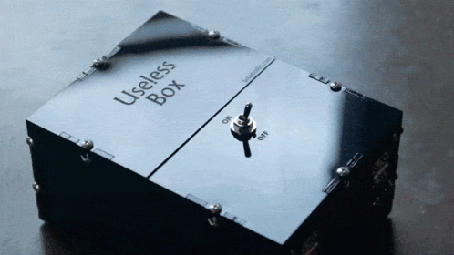

# 🟣 FINDINGS

This will be about some of my findings and other contributions to the community. 

# 💜 Bugs 

N | Chain | Brief Description | Status
|:--|:--:|:--:|:--:|
1 | Solana | Detection of known vuln | **Rejected**   Vulnerability Mitigated in code in another block
2 | Ethereum | Automated Detection | **Not Submitted**   Building POC   Undergoing Manual Testing

> 👉 Due to certain restrictions I am unable to disclose the exact details of my findings.   
# 💜 Community Contributions 

> 👉 This is perpetually active. Releases are usually in my [Twitter](https://twitter.com/m0ham3dxx) or [Youtube Channel](https://www.youtube.com/channel/UClypqHQkhsNZSD0eRmN3Piw/)  

## [Youtube Tutorials](https://www.youtube.com/channel/UClypqHQkhsNZSD0eRmN3Piw/) 

The following are the youtube tutorials which I had made during the period of the scholarship. 

### [m0ham3dx](https://www.youtube.com/channel/UClypqHQkhsNZSD0eRmN3Piw/) - [deth.net](https://www.deth.net/) Ethereum Code Viewer Tutorial

<iframe width="560" height="315"
src="https://www.youtube.com/embed/d9xE8Cyj7dU?&autoplay=1"frameborder="0" 
allowfullscreen></iframe>

### [m0ham3dx](https://www.youtube.com/channel/UClypqHQkhsNZSD0eRmN3Piw/) - [Sec3.Dev (Soteria)](https://www.sec3.dev/) - Solana Automatic Audit Software Usage & Tutorial

<iframe width="560" height="315"
src="https://www.youtube.com/embed/jmVBybO6EIo?&autoplay=1"frameborder="0" 
allowfullscreen></iframe>

## Open Source Contributions 

### Add CLI Demo for [SergeKireev/ ethereum-sources-downloader](https://github.com/SergeKireev/ethereum-sources-downloader)

[CLI DEMO HERE](https://github.com/SergeKireev/ethereum-sources-downloader/blob/main/essdemo.gif) - `NPM` based Smart Contract scraper from a variety of chains

### Add CLI Demo for [pratraut /scrapyFi](https://github.com/pratraut/scrapyFi)

[CLI DEMO](https://github.com/pratraut/scrapyFi) - [This](https://github.com/pratraut/scrapyFi/blob/master/demogifs/1List.gif), [This](https://github.com/pratraut/scrapyFi/blob/master/demogifs/2SearchAndDownload.gif) , [This](https://github.com/pratraut/scrapyFi/blob/master/demogifs/3DLSingleContract.gif) - `Python` Smart Contract scraper from a variety of chains.

