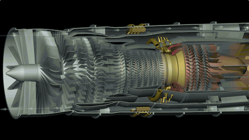

# 🔵 OUTCOMES

The outcomes are increase in skill and understand 

N | Attribute | Meter
|:--:|:--:|:--:|
1 | Solidity   Development | <label for="fuel"> ~50%  </label><meter id="fuel" min="0" max="100" low="33" high="66" optimum="80" value="50"></meter>
2 | Web3   Bug   Hunting | <label for="fuel">~60% </label><meter id="fuel" min="0" max="100" low="33" high="55" optimum="80" value="60"></meter>
3 | Web2   Bug   Hunting | <label for="fuel">~60% </label><meter id="fuel" min="0" max="100" low="33" high="55" optimum="80" value="60"></meter>
4 | Other Smart Contract Languages | <label for="fuel">~30% </label><meter id="fuel" min="0" max="100" low="33" high="80" optimum="80" value="30"></meter>

# 💙 Conclusion

